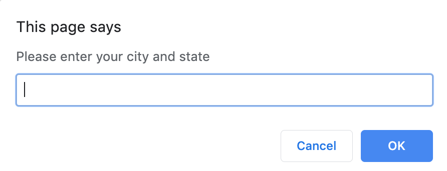
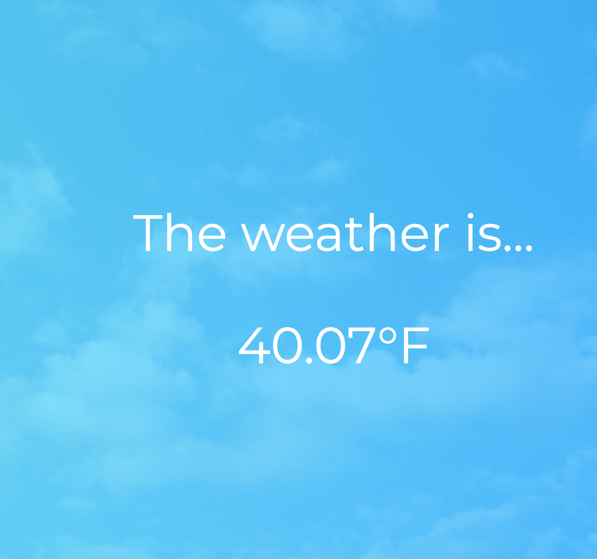

# Weather App
This app was made so that a user can input their location and then get the exact weather in fahrenheit for the current moment.

## Example Images 
 

## Prerequisites
 * Must have [CORS extension](https://chrome.google.com/webstore/detail/allow-cors-access-control/lhobafahddgcelffkeicbaginigeejlf?hl=en)

## Configuration
A prompt will pop up requesting a user's location.  The user will input their location which will be added to the end of the mapquest endpoint.  A fetch get request is made to the mapquest API and will return the user's longitude and latitude.  The longitude and latitude is added to the end of the darksky endpoint.  Then a fetch get request is made to the darksky API, which will return the current weather in fahrenheit for the location that the user inputted.
